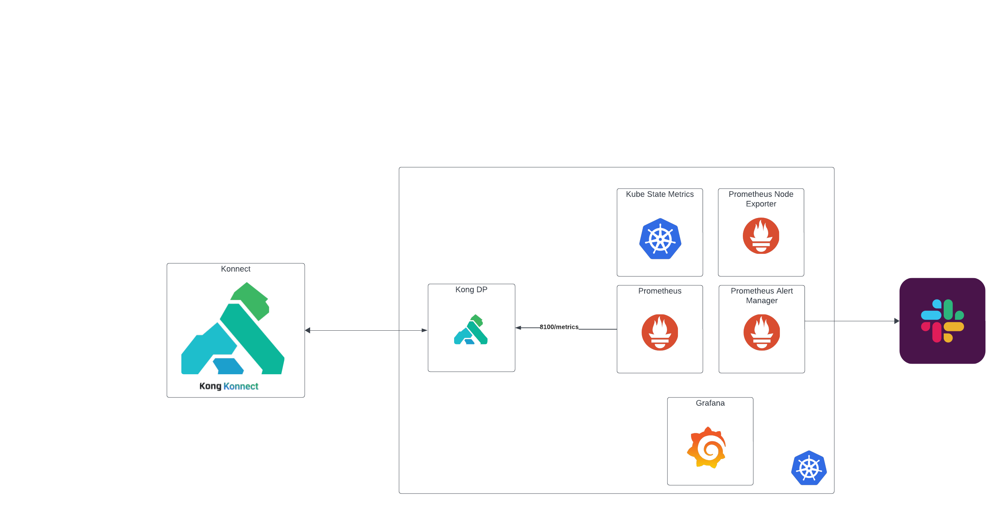

# Kong Tutorial
## How to Add Observability to Your Application With Prometheus
This Tutorial shows how to configure metrics with Kong Konnect



## Pre-step
The first thing you need is a Kong Konnect account so go ahead and register for one [here](https://cloud.konghq.com)

Once you have logged in navigate to
`Organization > System Accounts`
and create a new system account

Once thats created, generate a new token for that system account and copy the token value

Then store this value in a bash variable to be used in all the steps below
```shell
TOKEN=<paste value>
```
Let navgate to this tutorials folder
```shell
cd kong/001-observability-prometheus
```
## Setup
Let's ensure our system has all the necessary tools. This setup script installs

1. podman-desktop
2. kind
3. kubernetes-cli
4. httpie
5. k6 
6. helm
7. k9s

```shell
cd 01-setup
bash ./01-init.sh
```

### Configure Podman
The one important thing to change is the memory of Podman. The default is 2G,
I would recommend using 4G at a min due to the fact that prometheus etc uses
quiet a bit of memory

Once podman has restarted then create your k8s cluster
```shell
bash ./02-create-cluster.sh
```
You should now be able to connect to your cluster using k9s
```shell
k9s
```

## Install Prometheus
First thing is to install prometheus operator
```shell
cd ../02-install-prometheus
bash ./01-install_prometheus.sh
```

## Install Kong
Now let's install Kong, to do this we need to create a few entities in Konnect
### Create a control plane
First thing we need is a Konnect Control plane
```shell
cd ../03-install-kong
bash ./01-create-control-plane.sh $TOKEN
```

### Generate helm chart values
We then take the output from the Konnect control plane and use those values
to generate a values override file to use when installing Kong
```shell
bash ./02-create-helm-values.sh $TOKEN
```

### Generate certificates
In order for our dataplane to connect to the Konnect control plane we need
to generate and share a set of SSL certificates, so lets generate some
```shell
bash ./03-create-certs.sh $TOKEN
```

### Install Kong
And then finally we take all of that and put it together and install
a Kong dataplane using the kong helm chart and then new values file
we just generated above
```shell
bash ./04-install_kong.sh
```

Login to your Konnect account and find your newly created Control Plane and
connected dataplane

## Expose Kong Metrics
Now lets expose some metrics on our dataplane. This is done by adding the
Prometheus plugin. This plugin can be added to either a service or a route, 
so let's create both.

### Create service
Firstly lets create a service, upstream and target. This tutorial defaults
the upstream to https://httpbin.org but this could be anything
```shell
cd ../04-expose-kong-metrics
bash ./01-create-service.sh $TOKEN
```

### Create route
Create a route on the service called `/demo`
```shell
bash ./02-create-route.sh $TOKEN
```

### Add Prometheus plugin
And finally add the prometheus plugin. This plugin will ensure that the metrics
endpoint located at the status endpoint on port `8100` is readable by prometheus
```shell
bash ./03-add-plugin.sh $TOKEN
```

### Testing it out
With all this configured we can test out the newly created route
Lets port forward the proxy port `8000`
```shell
kubectl port-forward pod/$(kubectl get pods -n kong --no-headers -o custom-columns=":metadata.name") -n kong 8000:8000
```
Then lets hit that endpoint and see the result
```shell
http :8000/demo
```
```shell
HTTP/1.1 200 OK
Access-Control-Allow-Credentials: true
Access-Control-Allow-Origin: *
Connection: keep-alive
Content-Length: 566
Content-Type: application/json
Date: Wed, 28 Feb 2024 23:05:41 GMT
Server: gunicorn/19.9.0
Via: kong/3.6.0.0-enterprise-edition
X-Kong-Proxy-Latency: 1
X-Kong-Request-Id: 7785df59404ddf6da349b9076ac34167
X-Kong-Upstream-Latency: 375

{
    "args": {},
    "data": "",
    "files": {},
    "form": {},
    "headers": {
        "Accept": "*/*",
        "Accept-Encoding": "gzip, deflate",
        "Host": "httpbin.org",
        "User-Agent": "HTTPie/3.2.2",
        "X-Amzn-Trace-Id": "Root=1-65dfbc45-4972f1ea6b30d373795bf5ed",
        "X-Forwarded-Host": "localhost",
        "X-Forwarded-Path": "/demo",
        "X-Forwarded-Prefix": "/demo",
        "X-Kong-Request-Id": "7785df59404ddf6da349b9076ac34167"
    },
    "json": null,
    "method": "GET",
    "origin": "127.0.0.1, 141.195.160.128",
    "url": "https://localhost/anything"
}
```

## Scrape prometheus endpoint
Now with Kong configured with metrics lets tell prometheus about this.
There are a number of ways of doing this, the easiest is to create a `ServiceMonitor`
resource which can be done easily with the Kong helm chart

```shell
cd ../05-scrape-metrics
bash ./01-enable-service-monitor.sh
```
With that enabled, port forward to prometheus and check that its being scraped
```shell
kubectl port-forward pod/$(kubectl get pods -n monitoring -l app.kubernetes.io/name=prometheus --no-headers -o custom-columns=":metadata.name") -n monitoring 9090:9090
```
Then navigate to `http://localhost:9090` in your browser and go to `Status > Targets` and you should see your 
Kong dataplane in the list (may need to wait few minutes for it to show up)

## Grafana Visualizations
Now let add the Kong dashboard to Grafana, it can be found on the Grafana marketplace [here](https://grafana.com/grafana/dashboards/7424-kong-official/)
```shell
cd ../06-grafana-visualization
bash ./01-add-kong-dashboard.sh
```

With that added lets run a k6 load test to get some data
```shell
bash ./02-run-load-test.sh
```

Port forward Grafana, login and go check out the Kong Prometheus dashboard
```shell
kubectl port-forward pod/$(kubectl get pods -n monitoring -l app.kubernetes.io/name=grafana --no-headers -o custom-columns=":metadata.name") -n monitoring 3000:3000
```
Then navigate to `http://localhost:3000` in your browser

Default user is admin and the password lives in the grafana secret
```shell
kubectl get secret prometheus-grafana -n monitoring -o json | jq -r '.data["admin-password"]' | base64 -d
```
## Alerting
Lastly lets configure prometheus alert manager to send alerts to a Slack channel

1. Login to Slack
2. Create a new channel: `kong-prometheus-tutorial`
3. Navigate to Tools & Settings
4. Navigate to Configure Apps
5. Click Build
6. Create New App > From an app manifest
7. Select workspace > Next
8. Change name to Prometheus > Next
9. Create
10. Incoming Webhooks
11. Click On
12. Add New Webhook to Workspace
13. Select channel created in point 2: `kong-prometheus-tutorial`
14. Allow
15. Copy Webhook URL

With your newly created webhook configure prometheus alert manager
with this webhook

```shell
cd ../07-alerting
bash ./01-configure-slack.sh https://hooks.slack.com/services/xxx/yyy/zzz
```

Now navigate to Slack and your new channel and within minutes you should see 
your alerts popup

## Cleanup
To clean up all generated files, the kind cluster as well as the Konnect
control plane, run the cleanup script with the token

```shell
cd ../00-cleanup
bash cleanup.sh $TOKEN
```

## Complete overrides
The complete helm overrides created throughout the tutorial can be found in the
folder `08-complete-helm-overrides`

You still need to replace some variables within them but you can use them 
as templates if you want to run this tutorial in one go instead of step by step

Only assumptions with the below commands are:
1. Your TLS certs are already generated
If not you can generate them with
```shell
openssl req -new -x509 -nodes -newkey ec:<(openssl ecparam -name secp384r1) -keyout certs/tls.key -out certs/tls.crt -days 1095 -subj "/C=GB/ST=London/L=London/O=Global Security/OU=IT Department/CN=example.com"
```
2. Your Kong Control plane is already created and TLS certs uploaded
3. Your Slack app & webhook is already created

```shell
helm install prometheus prometheus-community/kube-prometheus-stack -f /08-complete-helm-overrides/prometheus.yaml -n monitoring --create-namespace

kubectl create ns kong
kubectl create secret tls kong-cluster-cert -n kong --cert=./certs/tls.crt --key=./certs/tls.key --namespace kong
helm upgrade -i konnect-dp kong/kong -n kong -f ./08-complete-helm-overrides/kong.yaml
```
